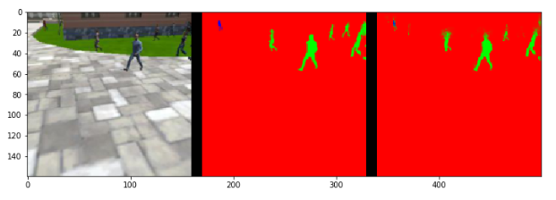
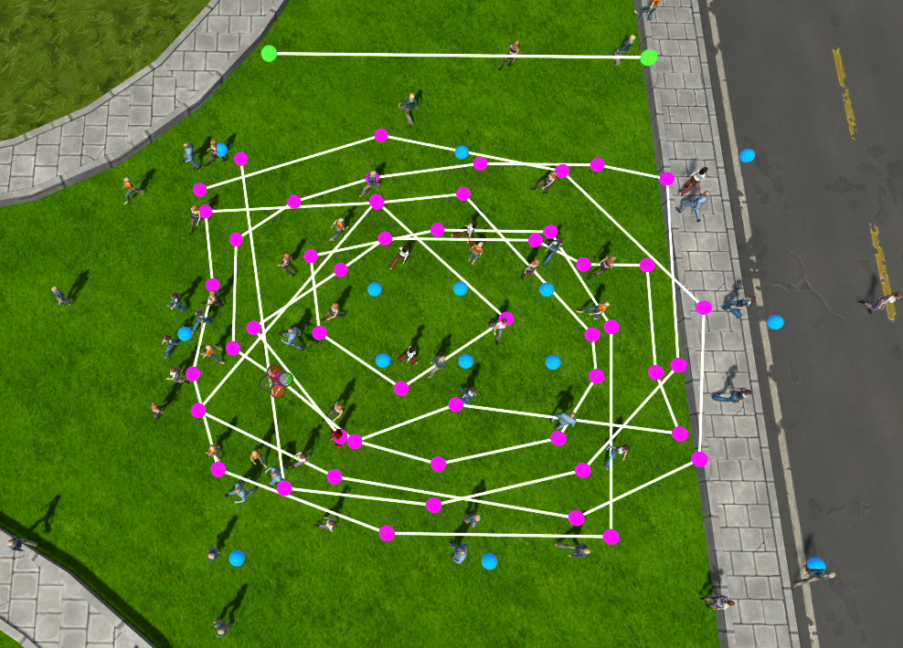
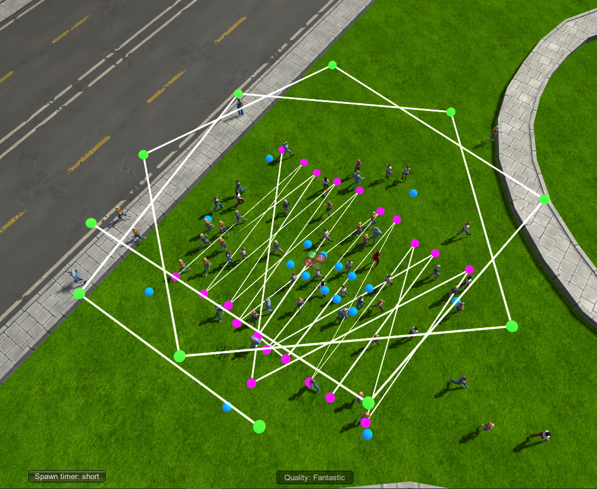
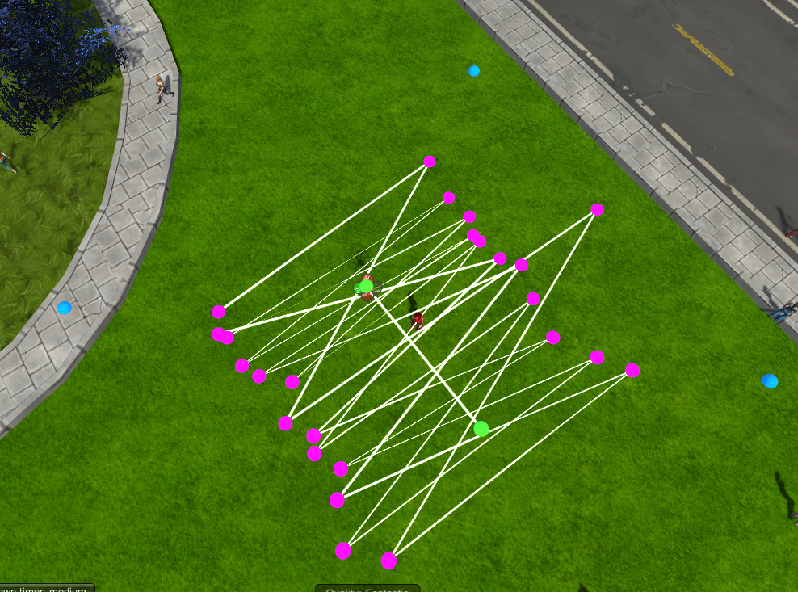
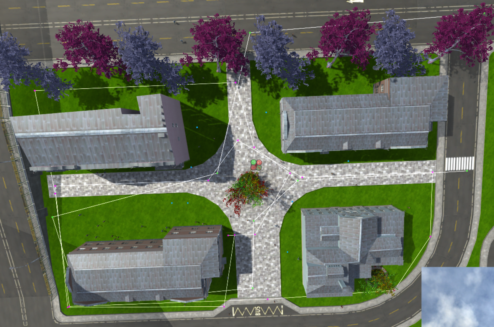
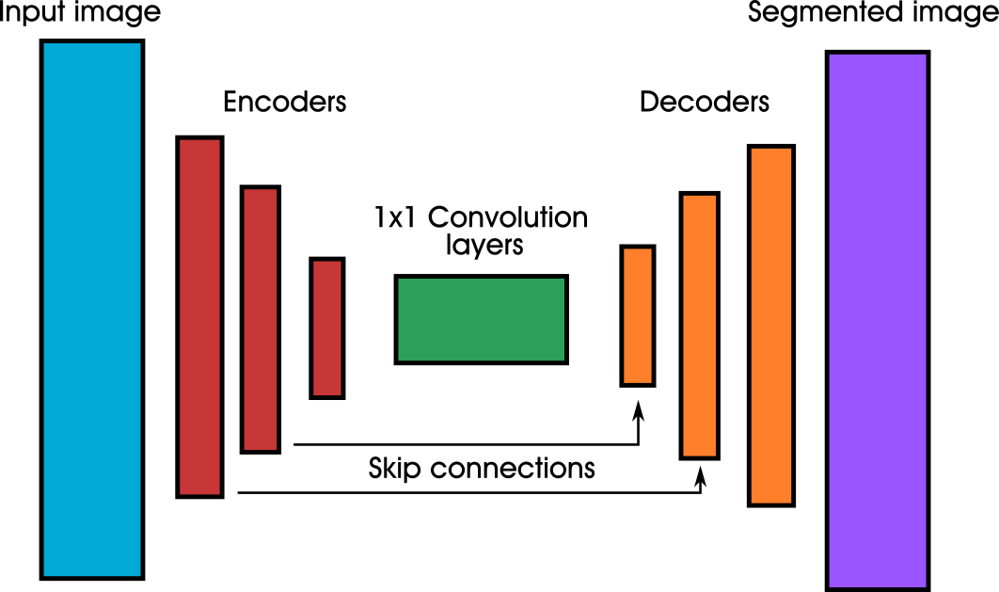
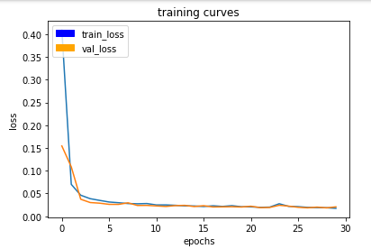

## Project: Follow me

[//]: # (Image References)

[main]: ./misc_images/main.png
[run1_crowd]: ./misc_images/run1_crowd.png
[run2_short]: ./misc_images/run2_short.png
[run3_zigzag]: ./misc_images/run3_zigzag.png
[PatrolPath]: ./misc_images/PatrolPath.png
[following]: ./misc_images/following.png
[withoutTarget]: ./misc_images/withoutTarget.png
[withTarget]: ./misc_images/withTarget.png



In this project, a Fully Convolutional Network will be implemented and trained to detect a person with a
quadrotor. This simulation will be carried out in the provided FollowMeSim, which includes a city with people 
and the person to be tracked.

### Data Collection
The first step was taking more pictures to train our network. As suggested in Data Collection Guide, three
situations have been considered:
* Data gathered by following the hero in a very dense crowd.
* Data gathered while in patrol directly over the hero, while they zigzag.
* Data gathered while the quad is on standard patrol.

Below, it can be seen the paths which have been implemented in FollowMeSim.

* Hero in a very dense crowd with quad in following mode



* Hero in a very dense crowd with quad in patrol mode



* Hero in zigzag while the quad is patrolling over it.



* Quad in standard patrol


With those simulations the total number of train images are 7941 and 3617 validation images.

### Network architecture
Given the type of identification that we need in this project, we will be working with Fully Convolutional Networks(FCNs).
This kind of network is used when detecting an object between several ones. In our case, we have a person in a city
surrounded by other people. This is made possible because fully convolutional networks preserve spatial information
while doing the convolution.

FCNs take advantage of three special techniques:
* Replace fully connected layers with one by one convolutional layers
* Upsampling using trasposed convolutional layers
* Skip connections, which allow the network to use information from multiple resolution scales. Thus, carrying out
more precise segmentation decisions.

The network consists in three main parts, the encoder, the 1x1 convolution layer and the decoder. The encoder extracts 
features from the layers that will be used later by the decoder, which uses a technique of transposed convolutional 
layers to upsample the image.

The implemented network has three encoders, 1x1 convolution layers and 3 decoders, as it can be seen below.

```
Features Layer (?, 160, 160, 3)
Encoder 1 (?, 80, 80, 32)
Encoder 2 (?, 40, 40, 64)
Encoder 3 (?, 20, 20, 128)
1x1 Conv (?, 20, 20, 128)
Decoder 1 (?, 40, 40, 128)
Decoder 2 (?, 80, 80, 64)
Decoder 3 (?, 80, 80, 64)
Output Layer (?, 160, 160, 3)
```

In the following image a squeme of the network has been depicted.



### Hyperparameters

The parameters which have been used to train the network can be found below. 

* learning_rate = 0.001
* batch_size = 32
* num_epochs = 30
* steps_per_epoch = int(7941/batch_size)-1
* validation_steps = int(3617/batch_size)
* workers = 2

Those parameters have been found by tunning manually the network. Initially, a higher learning rate value was set up, 
but it was notice that the network was learning too fast. It was observed that increasing the number of epochs leads to
a lower loss value, however, computing time increases, thus, a value of 30 has been found to be a good equilibrium point. 
Steps per epoch have been set to the recommended value computed as the number of training data divided by the batch size.
The validation steps have been computed in a similar way.


### Results

Below, loss and validation loss values during training have been depicted. It can be seen that, although, there is a slight
spike in epoch 23, the algorithm is stable reaching a final value of 0.02 approximately.




Scores are shown below, it can be seen that the final grade score is 0.4326.

```
#Scores for while the quad is following behind the target. 
number of validation samples intersection over the union evaulated on 542
average intersection over union for background is 0.9963649904368955
average intersection over union for other people is 0.374343463883581
average intersection over union for the hero is 0.9202535829853801
number true positives: 539, number false positives: 0, number false negatives: 0

# Scores for images while the quad is on patrol and the target is not visable
number of validation samples intersection over the union evaulated on 270
average intersection over union for background is 0.9909623240530145
average intersection over union for other people is 0.8147482312946245
average intersection over union for the hero is 0.0
number true positives: 0, number false positives: 27, number false negatives: 0

# Score to measure how well the neural network can detect the target from far away
number of validation samples intersection over the union evaulated on 322
average intersection over union for background is 0.9969959805429339
average intersection over union for other people is 0.4654899637565508
average intersection over union for the hero is 0.21417443633161937
number true positives: 123, number false positives: 1, number false negatives: 178

# Sum all the true positives, etc from the three datasets to get a weight for the score
0.7626728110599078

# The IoU for the dataset that never includes the hero is excluded from grading
0.567214009658

# Final grade score
0.432598703219
```
# Conclusion
This network architecture could be used to follow another objects, however, it is clear that this training set is not valid for that purpose.
We would have to create a new set of images for both training and validation procedures. In general, this kind of network squeme could be 
used to carry out object recognition. For example it could be used for self-driving cars to recognize road markings, traffic lights or pedestrians.
But, always, those applications could be carried out by training the network with a specific data set.


# Future Enhancements
In my opinion, the network could be improved implementing a deeper network in order to distinguish more features, thus increasing accuracy. In addition,
I think that increasing epochs or fine tuning the learning rate, the final grade score could be greater. As for the images, I think that the set is quite 
diverse, because images have been gathered in four different situations, appart from the default provided images.